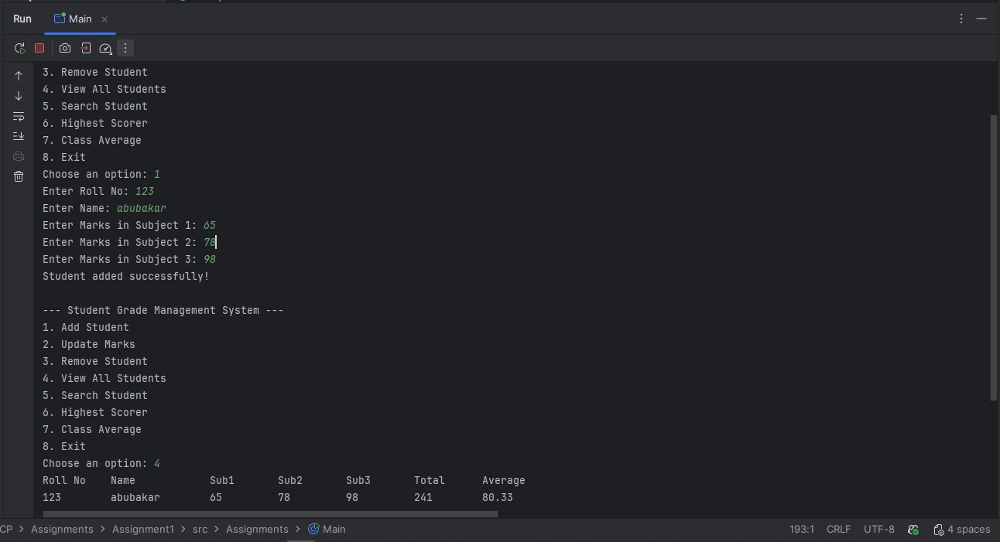

# Student Grade Management System (Java)

## 📌 Introduction
This project is my **Assignment #1** for the course at **Riphah International University, Islamabad Campus**.  
It is a simple **Student Grade Management System** implemented in Java.

The program helped me practice:
- Arrays
- Loops
- Conditionals
- Input validation
- Menu-driven programming

---

## 🎯 Features
The system provides the following functionalities:

1. **Add Student**
    - Enter roll number, name, and marks in 3 subjects.
    - Ensures roll numbers are unique.
    - Marks are validated to be between 0–100.
    - Maximum 50 students can be stored.

2. **Update Marks**
    - Update marks of a student by roll number.

3. **Remove Student**
    - Remove a student record by roll number.
    - Shifts the array elements so there are no gaps.

4. **View All Students**
    - Display all students in a **tabular format** with Roll No, Name, Marks, Total, and Average.

5. **Search Student**
    - Search for a student by roll number and display details.

6. **Highest Scorer**
    - Show the student with the highest total marks.

7. **Class Average**
    - Calculate the overall class average marks.

8. **Exit**
    - Ends the program with a summary of total students and class average.

---

## 🖥️ Sample Menu

## Conclusion
This assignment allowed me to implement a complete **menu-driven application** in **Java** using only arrays, loops, and conditionals, without advanced data structures.
It also gave me practice in input validation and ensuring the program handles invalid cases gracefully