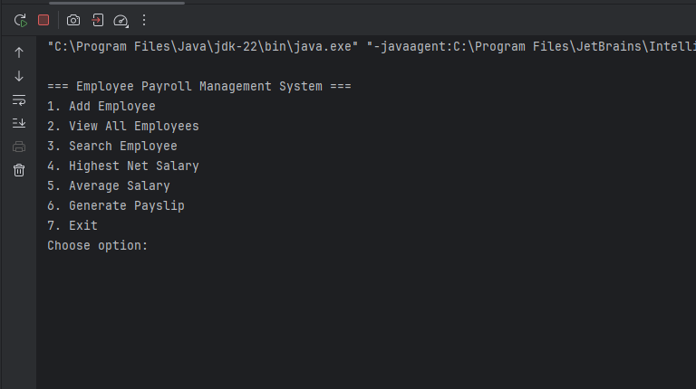

# 💼 Employee Payroll Management System

### 🏫 Riphah International University – Islamabad Campus
**Course:** Advanced Computer Programming  
**Assignment #2**  
**Student:** Abubakar Ahmad

---

## 📘 Project Overview
The **Employee Payroll Management System** is a console-based Java application that demonstrates key **Object-Oriented Programming (OOP)** concepts such as:

- **Encapsulation**
- **Inheritance**
- **Abstraction**
- **Polymorphism**
- **Interface Implementation**

It allows the management of employee records (both Permanent and Contract employees), calculation of salaries, and generation of payslips.

---

## 🧩 Features
✅ Add new employees (Permanent or Contract)  
✅ View all employee details in a tabular format  
✅ Search employee by ID  
✅ Find employee with the highest net salary  
✅ Calculate average net salary of all employees  
✅ Generate payslip for any employee  
✅ Exit with summary information

---

## 📸 Screenshots

*Main Menu*

*Employee List*